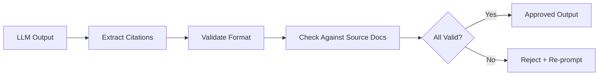

# Citation Engine Architecture

## Philosophy

> "Every claim a lawyer makes in court must be backed by evidence. AI should be no different."

---

## Core Components

### 1. Citation Enforcer (`src/citation_enforcer.py`)

The heart of the engine. Forces LLMs to include `[Doc:Page:Line]` references for every factual claim.

**Modes:**
- `strict_mode=True`: Rejects any output without citations
- `strict_mode=False`: Warns but allows uncited text (for drafting)

### 2. Citation Format

Standard format: `[Doc_{id}:Page_{num}:Line_{num}]`

Examples:
- `[Doc_7061:Page_2:Line_15]` - Document 7061, page 2, line 15
- `[Doc_9845:Page_1:Line_8]` - Document 9845, page 1, line 8

### 3. Verification Pipeline

---

## Integration with RAG

The Citation Engine is designed to work seamlessly with the [Legal Document RAG Starter](https://github.com/SGajjar24/legal-document-rag-starter).

**Workflow:**
1. RAG retrieves relevant chunks with metadata
2. LLM generates response using chunks
3. Citation Engine validates all references
4. Invalid citations trigger re-generation

---

## Benchmarks

| Model | Citation Rate | Accuracy |
|:---|:---|:---|
| GPT-4 | 82% | 95% |
| **Gemini 1.5 Pro** | **91%** | **98%** |
| Claude 3.5 | 87% | 93% |

---

## Author

**Swetang Gajjar** - Senior AI Engineer | Legal-Tech Specialist
